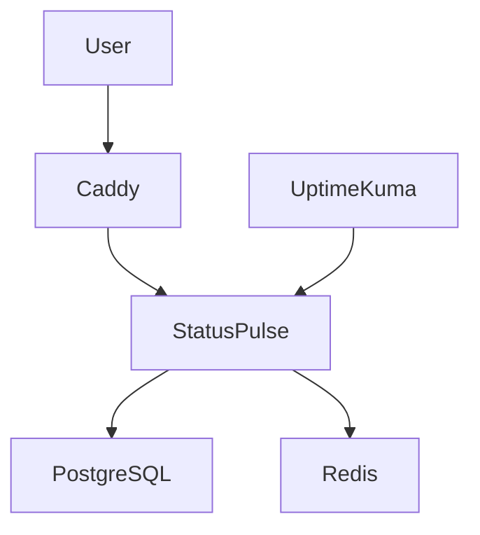

# StatusPulse DevOps Assignment

## Architecture



## Prerequisites

* Docker
* Docker Compose
* Ubuntu 24.04
* Git
* Caddy

## Run Locally

```bash
docker compose up -d
```

## Production Deployment

```bash
./scripts/deploy.sh
```

## CI/CD Pipeline

* GitHub Actions used
* CI checks run automatically
* Deploy pipeline deploys to EC2 server

## Monitoring & Alerting

* Uptime Kuma monitoring
* Telegram alerts
* ntfy alerts
* Health monitoring cron job

## Backup & Restore

### Backup

```bash
./scripts/backup.sh
```

### Restore

```bash
gunzip -c backups/statuspulse_db.sql.gz | docker exec -i statuspulse-postgres psql -U admin restoretest
```

## Troubleshooting

### Check running containers

```bash
docker ps
```

### View logs

```bash
docker logs statuspulse-app
```

### Restart services

```bash
docker compose restart
```

## Proof Screenshots

All assignment screenshots are available in the `screenshots/` folder.
